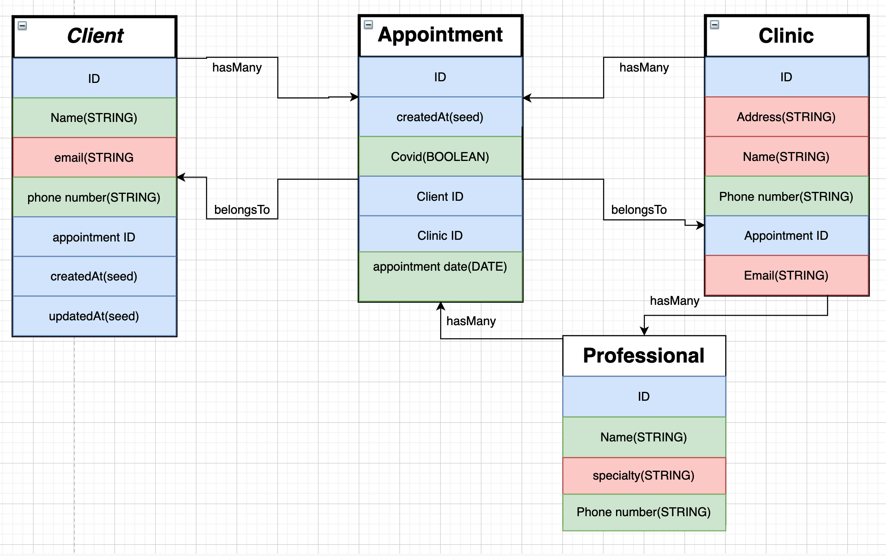

<p align="center">
  <a href="" rel="noopener">
 </a>
</p>

<h3 align="center">Sacamuelas Backend</h3>

<div align="center">

[]()
[](https://github.com/devian5/saca-muelas-back/issues)
[](https://github.com/devian5/saca-muelas-back/pulls)
[](/LICENSE)

</div>

---

<p align="center"> Dental clinic backend with mySQL and SequelizeORM.
    <br> 
</p>

## 📝 Table of Contents

- [About](#about)
- [Getting Started](#getting_started)
- [Deployment](#deployment)
- [Usage](#usage)
- [Built Using](#built_using)
- [Contributing](../CONTRIBUTING.md)
- [Authors](#authors)
- [Acknowledgments](#acknowledgement)

## 🧐 About <a name = "about"></a>
This is a project to prove our skills on SQL based backend.

## 🏁 Getting Started <a name = "getting_started"></a>
**We created  this project with every dependency in a docker container.**

To run our app you have two options:
Either run docker compose containers with this command.

```
docker-compose up 
```
After this,you get into the container and install every dependency described below this text.

```
docker exec -it <containerID> bash
```
```
npm install sequelize-cli -g
```
```
npm install
```

The second option is to install every dependency in local and for that you have to do the same proces but skipping the `docker-compose` part.


After installing every dependency, you can get a command list using

```
sequelize
```
Inside of this list you have to run the next three.
```
sequelize db:create
```
```
sequelize db:migrate
```
```
sequelize db:seed:all
```
To test our app, you hace a postman collection in this link.

[](https://app.getpostman.com/run-collection/06b90141c7dbd28e8276)

## 🎈 Usage <a name="usage"></a>

We've been working with Trello for organization pourposes. Here is a picture of the workflow and a [link to it](https://trello.com/b/5JMx6vgG/sacamuelas-kanban).


We made a sketch on [diagrams](https://app.diagrams.net/)



## ⛏️ Built Using <a name = "built_using"></a>

- [mySQL](https://www.mysql.com/) - Database
- [Express](https://expressjs.com/) - Server Framework
- [docker](https://docker.org/) - Container Manager
- [NodeJs](https://nodejs.org/en/) - Server Environment
- [Sequelize](https://sequelize.org) -SQL ORM 

## ✍️ Authors <a name = "authors"></a>

- [@DanielC1492](https://github.com/DanielC1492) - Idea & Initial work
- [@devian5](https://github.com/devian5) - Idea & Initial work

See also the list of [contributors](https://github.com/FullStackDeveloperValenciaGeeksHubs0121) who participated in this project.
